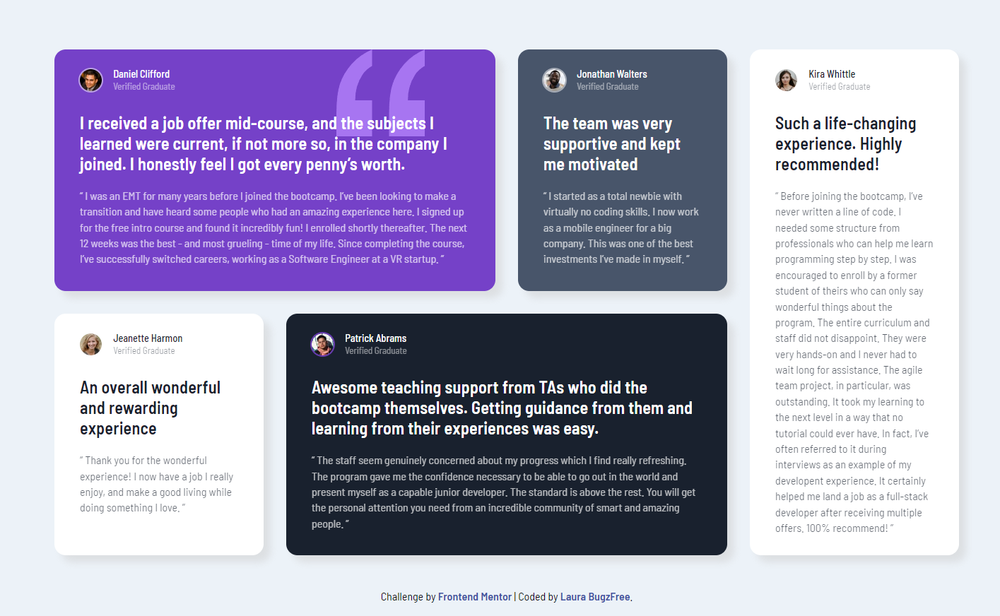

# Frontend Mentor - Testimonials grid section solution

This is a solution to the [Testimonials grid section challenge on Frontend Mentor](https://www.frontendmentor.io/challenges/testimonials-grid-section-Nnw6J7Un7). Frontend Mentor challenges help you improve your coding skills by building realistic projects. 

## Table of contents

- [Overview](#overview)
  - [The challenge](#the-challenge)
  - [Screenshot](#screenshot)
  - [Links](#links)
- [My process](#my-process)
  - [Built with](#built-with)
  - [What I learned](#what-i-learned)
  - [Continued development](#continued-development)
  - [Useful resources](#useful-resources)
- [Author](#author)

**Note: Delete this note and update the table of contents based on what sections you keep.**

## Overview

### The challenge

Users should be able to:

- View the optimal layout for the site depending on their device's screen size

### Screenshot

### Links

- Solution URL: [Add solution URL here](https://your-solution-url.com)
- Live Site URL: [Add live site URL here](https://your-live-site-url.com)

## My process

### Built with

- CSS custom properties
- Flexbox
- CSS Grid
- Mobile-first workflow

### What I learned

- This Challenge was used to practice Grid.
- Keeping things simple
- I looked into selectors and pseudo classes to better understand the stylings Kevin Powell used in his video

### Continued development

As a beginner, I have a long way to go in my learning journey.
I am struggling to keep things simple and I find the more I know the more difficult it is to do so.
The only thing I can do is continue to practice.

### Useful resources

- [Learn CSS Grid the easy way by Kevin Powell](https://www.youtube.com/watch?v=rg7Fvvl3taU&t=470s) - This was a big help as it showed me how to not over complicate things
- [The new CSS pseudo-classes explained - :is() :where() :has() by Kevin Powell](https://www.youtube.com/watch?v=3ncFpP8GP4g&t=1s) - This is a very useful video on pseudo-classes

## Author

- Frontend Mentor - [@Laura-BugFree](https://www.frontendmentor.io/profile/Laura-Bugfree)

